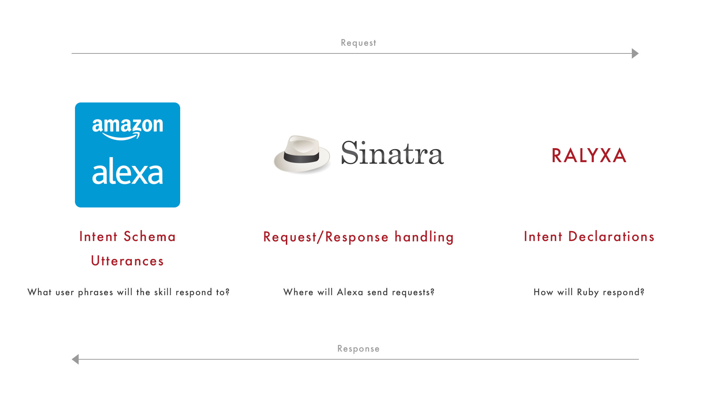

# Alexa 5: Building an Intermediate Skill with Ruby and Alexa

> We will be using the [Ralyxa](https://github.com/sjmog/ralyxa) framework during this module.

We have constructed a series of skills that allow us to interact with, and control, Alexa. However, our skills rely on data held in-memory within our Sinatra applications. All data passed to and from Alexa is wiped whenever we restart our Sinatra application.

During this module, you will construct an intermediate skill called _Pizza Buddy_. This skill will allow users to:

- Place pizza orders, and
- Query orders that have been made.

We will use the Session to design a multi-stage ordering process. We will store and retrieve orders using a [Postgres](https://www.postgresql.org/) relational database. We will use [Datamapper](http://datamapper.org/) as the translation later ('ORM') between our Sinatra application and the Postgres database. Finally, we will post Cards to the user, displaying simple information about the orders that have been made.

## Overview

> A completed version of the _Pizza Buddy_ application is available [here](https://github.com/sjmog/pizza_buddy). You can use the commits to guide your build, or fork and play with the completed application. This walkthrough covers commits 1 - 12.

You can take two routes through this walkthrough:

1. **Quick Steps:** have some experience of Alexa or Ruby? This is a challenge-based way to approach building Pizza Buddy. It's designed for people who want to build their ability to implement, rather than understand. It's a more frustrating, but rewarding, approach.
2. **Detailed Walkthrough:** new to Alexa and Ruby? Want to get a clear grounding in some Alexa/Ruby techniques? This step-by-step walkthrough guides you through the entire process. It's also a helpful reference tool for those attempting the **Quick Steps**: if you get stuck, you can refer to the detailed walkthrough.

The Quick Steps map directly onto the Detailed Walkthrough: each Quick Step has an associated chapter in the Detailed Walkthrough.

## Quick Steps

### Setting up a new skill and application using Ralyxa
1. Set up a new skill, called 'Pizza Buddy', with an invocation name of 'pizza buddy'
2. Set up a new Sinatra application, tunneled with ngrok
3. Install the latest version of [Ralyxa](https://github.com/sjmog/ralyxa) to the application ([Checkpoint 1](https://github.com/sjmog/pizza_buddy/commit/b151b1e90e3d01aabf889721a45bf5e8db2fd0ea))

### Defining a multi-stage conversation
4. Define a `StartPizzaOrder` intent in the Alexa Developer Portal, with one Utterance: "StartPizzaOrder new pizza".
5. Define a `StartPizzaOrder` intent declaration in the Sinatra application, responding with a prompt to pick a size of pizza.
6. Define a `LaunchRequest` intent declaration in the Sinatra application. Respond with a simple 'welcome' message ([Checkpoint 2](https://github.com/sjmog/pizza_buddy/commit/caac02c0c11234dc877141c45df3311c2604a53f))
7. Add a `Pizza` object to the Sinatra application, which presents the available sizes of pizza ([Checkpoint 3](https://github.com/sjmog/pizza_buddy/commit/4e554f02e72c9493c4c77e3100826aafeedb12f4))
8. Define a `ContinuePizzaOrder` intent in the Alexa Developer Portal, with one slot, named `size`, of type `PIZZA_SIZE`, a custom slot. Define a custom slot, `PIZZA_SIZE`, with values depending on the sizes you offer in your response to the `StartPizzaOrder` intent.
9. Define a `ContinuePizzaOrder` intent declaration which saves the user's choice of pizza size to the session, and prompts for pizza toppings
10. Define a `PenultimatePizzaOrder` intent in the Alexa Developer Portal, with slots for up to five toppings
11. Define the Utterances for the `PenultimatePizzaOrder`, handling between one and five toppings
12. Define a `PenultimatePizzaOrder` intent declaration confirming the size and toppings ([Checkpoint 4](https://github.com/sjmog/pizza_buddy/commit/0fc940187405ed9eb29e8a05929e4a7308cdc831))
13. Reprompt users if they choose disallowed toppings ([Checkpoint 5](https://github.com/sjmog/pizza_buddy/commit/7bfe879d5e4b3bdf98d4937d90fce19fc27ab9fa))
14. Define a `ConfirmPizzaOrder` intent in the Alexa Developer Portal
15. Define a `ConfirmPizzaOrder` intent declaration, which saves the confirmed pizza to the database ([Checkpoint 6](https://github.com/sjmog/pizza_buddy/commit/584832e8ce4dfe396b39d2831897f7224967e153))

### Interacting with persisted data
16. Implement a `ListOrders` intent, listing `Pizza` entities saved in the database ([Checkpoint 7](https://github.com/sjmog/pizza_buddy/commit/4c125ed0ed0f39f7e6d927b4e337eccbd9977f38))
17. Implement a `ListToppings` intent, which lists the available permitted toppings ([Checkpoint 8](https://github.com/sjmog/pizza_buddy/commit/54dd44349c5a0fef17fdd0df7708ef644b21bd86))
18. Add a [Standard Card](https://developer.amazon.com/public/solutions/alexa/alexa-skills-kit/docs/providing-home-cards-for-the-amazon-alexa-app#creating-a-home-card-to-display-text-and-an-image) on order confirmation, using Ralyxa's [Card API](https://github.com/sjmog/ralyxa#using-cards) ([Checkpoint 9](https://github.com/sjmog/pizza_buddy/commit/0ddf8aeaa8adf9578782f0fa824a5ca8b45e8037))

## Detailed Walkthrough

### Setting up a new skill and application using Ralyxa

#### 1. Set up a new skill, called 'Pizza Buddy', with an invocation name of 'pizza buddy'

Our first step, as always, is to set up the skill on Amazon. We'll want to call this skill 'Pizza Buddy', with an invocation name of 'pizza buddy'. We won't need account linking.

#### 2. Set up a new Sinatra application, tunneled with ngrok

Create a new directory (we'll refer to this as the 'application directory'). Inside this directory, create a Gemfile, containing a single gem: `sinatra`. Also, install [ngrok](https://ngrok.com/). I'll assume you've downloaded ngrok to this directory.

Use `bundle install` to install all dependencies (in this case, just Sinatra), and add a `server.rb` file to the application directory.

> I'd advise using Ruby 2.3.1. If `bundle install` fails for you, you may need to install Bundler. Do this with `gem install bundler`.

Inside the `server.rb` file, add the following lines to a) require Sinatra, and b) add a single `POST` index route. This is the route Alexa will use to contact your application:

```ruby
# inside server.rb
require 'sinatra'

post '/' do
  # We'll fill this out in a minute
end
```

Here's your application directory at the end of this step:

```
.
├── Gemfile
├── Gemfile.lock
├── ngrok
└── server.rb
```

#### 3. Install the latest version of [Ralyxa](https://github.com/sjmog/ralyxa) to the application

> Ralyxa is a Ruby framework for interacting with Alexa. It simplifies a lot of the interactions on the Ruby side. This walkthrough assumes you are using, at a minimum, version 1.2.0 of Ralyxa. If you don't know your Ralyxa version, you're probably fine.

Add the `ralyxa` gem to your Gemfile, and `bundle install`. Update the `POST /` route in `server.rb` with the following:

```ruby
# inside server.rb
require 'sinatra'
require 'ralyxa'

post '/' do
  Ralyxa::Skill.handle(request)
end
```

> This will allow Ralyxa to hook in to, and respond to, any requests that come to your application.



Add a subdirectory within your application directory, called `intents`. This is where you will define your **Intent Declarations**, which are where you tell Ralyxa how to handle Alexa requests.

Here's your application directory at the end of this step:

```
.
├── Gemfile
├── Gemfile.lock
├── intents
├── ngrok
└── server.rb
```

> If you start the application now, with `ruby server.rb`, you'll see a warning that you haven't defined any intent declarations. This is expected, as we haven't defined any intent declarations yet.

### Defining a multi-stage conversation

#### 4. Define a `StartPizzaOrder` intent in the Alexa Developer Portal, with one Utterance: "StartPizzaOrder new pizza".

You can jump directly to this step by forking from [this commit](https://github.com/sjmog/pizza_buddy/commit/b151b1e90e3d01aabf889721a45bf5e8db2fd0ea).

In the next few steps, we hit the main bulk of our workflow. The pattern goes like this:

1. Define an Intent in our Intent Schema, in the Alexa Developer Portal. Define Utterances for this Intent (and possibly Custom Slot Types).
2. Define an **Intent Declaration** in our Sinatra application.
3. Test the two work together.

The first custom Intent will be the `StartPizzaOrder` Intent. Alexa will listen for the user to say:

> Order a pizza

And respond with:

> Great! What pizza would you like? You can pick from large, medium, and small.

First, define the Intent in the Intent Schema, in the Alexa Developer Portal:

```json
{
  "intents": [
    {
      "intent": "StartPizzaOrder"
    }
  ]
}
```

Next, define the Utterance for this intent:

```
StartPizzaOrder order a pizza
```

#### 5. Define a `StartPizzaOrder` intent declaration in the Sinatra application, responding with a prompt to pick a size of pizza.

Second, define the **Intent Declaration** in the Sinatra application. Add a new file, `start_pizza_order.rb`, to the intents subdirectory inside your application directory. Inside this, write the intent declaration as follows:

```ruby
intent "StartPizzaOrder" do
  ask("Great! What pizza would you like? You can pick from large, medium, and small.")
end
```

> It doesn't actually matter what you call this Ruby file, so long as you keep the file extension as `.rb`.

Here's how this works:

- `intent` says to Ralyxa "handle anything you hear from Alexa with an intent name `StartPizzaOrder`"
- `ask` says to Ralyxa "construct a JSON response for Alexa that makes Alexa say 'Great! What pizza would you like...'"
- Sinatra then sends this JSON back to Alexa, and Alexa asks the given question.

Test that your Alexa skill can send a `StartPizzaOrder` intent to your Sinatra application by doing the following:

- Start the development server with `ruby server.rb`.
- Start ngrok with `ngrok http 4567`, and copy the HTTPS endpoint ending in `.ngrok.io` to the clipboard.
- Add this HTTPS endpoint to your Alexa skill in the Alexa Developer Portal. If you're asked for a certificate, select "My development endpoint is a sub-domain of a domain that has a wildcard certificate from a certificate authority".
- **EITHER** use an Alexa device (or [Echosim](https://echosim.io)) to test the `LaunchRequest` by saying "Alexa, launch Pizza Buddy"
- **OR** write the following into the Service Simulator: "order a pizza", and hit 'Ask Pizza Buddy'.

If everything is correctly configured, you'll hear or see a response from your application.

Here's your application directory at the end of this step:

```
.
├── Gemfile
├── Gemfile.lock
├── intents
│   └── start_pizza_order.rb
├── ngrok
└── server.rb
```

#### 6. Define a `LaunchRequest` intent declaration in the Sinatra application. Respond with a simple 'welcome' message.

Sometimes, a user will want to launch a skill without specifying any particular action to take. This is called a `LaunchRequest`. For example:

> Alexa, launch Pizza Buddy

Should cause Alexa to respond with:

> Welcome to Pizza Buddy. Would you like a new pizza, or to list orders?

A `LaunchRequest` is a built-in Intent, so we don't need to define it in our Intent Schema. We can jump straight to implementing an **intent declaration**.

Add a new file, `launch_request.rb`, to the intents subdirectory inside your application directory. Inside this, write an intent declaration as follows:

```ruby
intent "LaunchRequest" do
  ask("Welcome to Pizza Buddy. Would you like a new pizza, or to list orders?")
end
```

Test that your Alexa skill can send a `LaunchRequest` to your Sinatra application by doing the following:

- Restart the server.
- **EITHER** use an Alexa device (or [Echosim](https://echosim.io)) to test the `LaunchRequest` by saying "Alexa, launch Pizza Buddy"
- **OR** paste the following JSON into the Service Simulator's _JSON_ panel:

```json
{
  "session": {
    "sessionId": "REDACTED",
    "application": {
      "applicationId": "REDACTED"
    },
    "attributes": {},
    "user": {
      "userId": "REDACTED"
    },
    "new": true
  },
  "request": {
    "type": "LaunchRequest",
    "requestId": "REDACTED",
    "locale": "en-GB",
    "timestamp": "2017-05-09T15:39:26Z"
  },
  "version": "1.0"
}
```

> You don't have to replace the words `REDACTED` with anything for this to send a successful `LaunchRequest`.

Here's your application directory at the end of this step:

```
.
├── Gemfile
├── Gemfile.lock
├── intents
│   ├── launch_request.rb
│   └── start_pizza_order.rb
├── ngrok
└── server.rb
```

#### 7. Add a `Pizza` object to the Sinatra application, which presents the available sizes of pizza

You can jump directly to this step by forking from [this commit](https://github.com/sjmog/pizza_buddy/commit/caac02c0c11234dc877141c45df3311c2604a53f).

Our `StartPizzaOrder` intent declaration currently reads as follows:

```ruby
intent "StartPizzaOrder" do
  ask("Great! What pizza would you like? You can pick from large, medium, and small.")
end
```

It would be great if this intent declaration read like this:

```ruby
intent "StartPizzaOrder" do
  ask("Great! What pizza would you like? You can pick from #{ Pizza::SIZES.to_sentence }")
end
```

Let's extract a `Pizza` object to hold the available sizes of pizza we offer. We'll follow a [Test-Driven Development](https://martinfowler.com/bliki/TestDrivenDevelopment.html) methodology. First, install [RSpec](http://rspec.info/) to the project by adding the `rspec` gem to your Gemfile, and using `bundle install` to install the dependency. Then, initialise RSpec using `rspec --init` from the command line.

> `rspec --init` should generate a couple of files for you, and a spec subdirectory. This is where our test files go.

Write a test for the `Pizza` object in a spec file, `pizza_spec.rb`, inside the spec subdirectory of your application directory:

```ruby
# in spec/pizza_spec.rb
require 'pizza'

RSpec.describe Pizza do
  describe 'SIZES' do
    it 'holds the available pizza sizes' do
      expect(described_class::SIZES).to eq [:large, :medium, :small]
    end
  end
end
```

Run the test using `rspec spec` from the application directory. It will fail: you need to create a lib directory, containing a `pizza.rb` file. This file will contain your `Pizza` code:

```ruby
# in lib/pizza.rb

class Pizza
  SIZES = [:large, :medium, :small]
end
```

Run the test again using `rspec spec` from the application directory. It should pass. We can now use our `Pizza` object in our intent declaration.

Before we can use it as intended, however, you will need to add the `activesupport` gem to your Gemfile and `bundle install` again. Now, we can express our available Pizza sizes as a string:

```ruby
# in intents/start_pizza_order.rb
require './lib/pizza'
require 'active_support/core_ext/array/conversions'

intent "StartPizzaOrder" do
  ask("Great! What pizza would you like? You can pick from #{ Pizza::SIZES.to_sentence }")
end
```

We can change our Pizza sizes easily, by altering the `Pizza::SIZES` constant and restarting the server.

Here's your application directory at the end of this step:

```
.
├── Gemfile
├── Gemfile.lock
├── intents
│   ├── launch_request.rb
│   └── start_pizza_order.rb
├── lib
│   └── pizza.rb
├── spec
│   ├── pizza_spec.rb
│   └── spec_helper.rb
├── ngrok
└── server.rb
```

#### 8. Define a `ContinuePizzaOrder` intent in the Alexa Developer Portal, with one custom slot: the available sizes of pizza

You can jump directly to this step by forking from [this commit](https://github.com/sjmog/pizza_buddy/commit/4e554f02e72c9493c4c77e3100826aafeedb12f4).

Remember our workflow?

1. Define an Intent in our Intent Schema, in the Alexa Developer Portal. Define Utterances for this Intent (and possibly Custom Slot Types).
2. Define an **Intent Declaration** in our Sinatra application.
3. Test the two work together.

Firstly, we need an Intent to handle the user's choice of pizza size, and an accompanying Utterance. 

Define a `ContinuePizzaOrder` Intent in the Alexa Developer Portal. This Intent needs one slot: the requested pizza size. Here's the complete Intent Schema for this, including previous steps:

```json
{
  "intents": [
    {
      "intent": "StartPizzaOrder"
    },
    {
      "intent": "ContinuePizzaOrder",
      "slots": [
        {
          "name": "size",
          "type": "PIZZA_SIZE"
        }
      ]
    }
  ]
}
```

`PIZZA_SIZE` is not a built-in slot type. Now define a custom slot type, named `PIZZA_SIZE`, with the possible pizza sizes (small, medium, large) as guiding values. These will help Alexa to recognise the kind of pizza the user is asking for. Now, define Utterances to invoke this Intent. Here's the complete Utterances after this step:

```
StartPizzaOrder order a pizza

ContinuePizzaOrder {size}
ContinuePizzaOrder a {size} pizza
```

> I've added two alternative Utterances. This is because it's quite likely our user will interact with the application in different ways. It's reasonable to expect the user to reply to "what size of pizza?" with "small/medium/large", or "a small/medium/large pizza". There are other possibilities too: you can add as many variants as you wish.

#### 9. Define a `ContinuePizzaOrder` intent declaration which saves the user's choice of pizza size to the session, and prompts for pizza toppings

Secondly, we need an Intent Declaration in Sinatra to handle the request Alexa will serve our application when the `ContinuePizzaOrder` Intent is invoked.

Define a declaration that pulls the requested size from the `size` slot, and persists it to the session for later use:

```ruby
# in intents/continue_pizza_order.rb
require './lib/pizza'

intent "ContinuePizzaOrder" do
  size = request.slot_value("size")
  response_text = ["OK, a #{ size } pizza. What would you like on that pizza? ",
                   "You can choose up to five items, or ask for a list of ",
                   "toppings. Or, choose another size: #{ Pizza::SIZES.to_sentence }"].join
  
  ask(response_text, session_attributes: { size: size })
end
```

> The `response_text` was pretty long, so I split it into an array of 'sentence parts'. Then, I've `join`ed the array into the final string.

Finally, we need to test that Alexa and Sinatra play together nicely. In the Service Simulator, on-device, or through Echosim, try asking Pizza Buddy for "a large pizza". You should be prompted to give your choice of toppings.

#### 10. Define a `PenultimatePizzaOrder` intent in the Alexa Developer Portal, with slots for up to five toppings

You can jump directly to this step by forking from [this commit](https://github.com/sjmog/pizza_buddy/commit/29c4ddd8ae11a6b23a065ed3d0a571bfc924d347).

The user can order a pizza with a given size. Now, they're being prompted to respond with a list of toppings. The ideal conversation flow should go something like this:

> **User:** Alexa, ask Pizza Buddy to order a pizza
> **Alexa:** Great! What pizza would you like? You can pick from large, medium, and small.
> **User:** A small pizza
> **Alexa:** OK, a small pizza. What would you like on that pizza? You can choose up to five items, or ask for a list of toppings. Or, choose another size: large, medium, and small.
> **User:** Cheese, ham, mushrooms
> **Alexa:** "OK, a small pizza with cheese, ham, and mushrooms. Is that right?

Let's start from our workflow:

1. Define an Intent in our Intent Schema, in the Alexa Developer Portal. Define Utterances for this Intent (and possibly Custom Slot Types).
2. Define an **Intent Declaration** in our Sinatra application.
3. Test the two work together.

We need an Intent to handle the user's choice of pizza toppings, and an accompanying Utterances. This is trickier than offering pizza sizes, as we want our Intent to handle anywhere between one and five toppings.

First, define a `PenultimatePizzaOrder` Intent in the Alexa Developer Portal. This Intent needs five slots: the requested pizza toppings. Here's the complete Intent Schema for this, including previous steps:

```json
{
  "intents": [
    {
      "intent": "StartPizzaOrder"
    },
    {
      "intent": "ContinuePizzaOrder",
      "slots": [
        {
          "name": "size",
          "type": "PIZZA_SIZE"
        }
      ]
    },
    {
      "intent": "PenultimatePizzaOrder",
      "slots": [
        {
          "name": "toppingOne",
          "type": "PIZZA_TOPPING"
        },
        {
          "name": "toppingTwo",
          "type": "PIZZA_TOPPING"
        },
        {
          "name": "toppingThree",
          "type": "PIZZA_TOPPING"
        },
        {
          "name": "toppingFour",
          "type": "PIZZA_TOPPING"
        },
        {
          "name": "toppingFive",
          "type": "PIZZA_TOPPING"
        }
      ]
    }
  ]
}
```

`PIZZA_TOPPING` is not a built-in slot type. Define a custom slot type, named `PIZZA_TOPPING`, with some possible pizza toppings as guiding values. I chose: tomato sauce, barbecue sauce, cheese, ham, pineapple, pepperoni, mushrooms, sweetcorn, and olives. These values will help Alexa to recognise the toppings the user is asking for. 

> These values only _guide_ Alexa's understanding. Users can still order toppings outside of this given range. We'll handle that case in section 13.

#### 11. Define the Utterances for the `PenultimatePizzaOrder`, handling between one and five toppings

Now, define Utterances to invoke this Intent. Since we want this intent to be invoked with _between one and five_ toppings, we define **cascading Utterances**. Here are the complete Utterances after this step:

```
StartPizzaOrder order a pizza

ContinuePizzaOrder {size}
ContinuePizzaOrder a {size} pizza

PenultimatePizzaOrder {toppingOne}
PenultimatePizzaOrder {toppingOne} {toppingTwo}
PenultimatePizzaOrder {toppingOne} {toppingTwo} {toppingThree}
PenultimatePizzaOrder {toppingOne} {toppingTwo} {toppingThree} {toppingFour}
PenultimatePizzaOrder {toppingOne} {toppingTwo} {toppingThree} {toppingFour} {toppingFive}
```

The `PenultimatePizzaOrder` Intent can now be invoked with between one and five toppings. If a user provides, say, four toppings, the final slot (`toppingFive`) will be empty.

#### 12. Define a `PenultimatePizzaOrder` intent declaration confirming the size and toppings

You can jump directly to this step by forking from [this commit](https://github.com/sjmog/pizza_buddy/commit/0fc940187405ed9eb29e8a05929e4a7308cdc831).

Our second step is to define an Intent Declaration in Sinatra to handle the request Alexa will serve our application when the `PenultimatePizzaOrder` Intent is invoked.

Define a declaration that pulls the toppings from the `toppingOne` to `toppingFive` slots (if they contain data), presents them to the user, and asks them to continue. Also, persist the size and toppings to the session for later use:

```ruby
# inside intents/penultimate_pizza_order
require 'active_support/core_ext/array/conversions'

intent "PenultimatePizzaOrder" do
  size = request.session_attribute('size')

  toppings = ['One', 'Two', 'Three', 'Four', 'Five'].inject([]) do |toppings, topping_number|
    topping = request.slot_value("topping#{ topping_number }")
    topping ? toppings + [topping] : toppings
  end

  ask("OK, a #{ size } pizza with #{ toppings.to_sentence }. Is that right?", session_attributes: { size: size, toppings: toppings })
end
```

> The `inject` function in the middle of this intent declaration iterates through available toppings and compiles an array of requested toppings (accounting for null values if the user ordered fewer than five toppings).

#### 13. Reprompt users if they choose disallowed toppings

We need a mechanism to stop the user from ordering non-existent toppings. An ideal interaction (from the start) would go like this:

> **User:** Alexa, ask Pizza Buddy to order a pizza
> **Alexa:** Great! What pizza would you like? You can pick from large, medium, and small.
> **User:** A small pizza
> **Alexa:** OK, a small pizza. What would you like on that pizza?...
> **User:** Cheese, ham, forgiveness
> **Alexa:** I'm afraid we don't have forgiveness. Please choose your toppings again, or ask for a list of available toppings.

Alexa should reply in the negative ("we don't have { unavailable topping }"), and prompt for the user to choose their toppings again. 

> Additionally, Alexa can offer the user the chance to hear a list of all toppings. We'll implement handling this later.

For easy changing, let's implement a method on `Pizza` that filters a given list of toppings, and returns disallowed ones. Start with a test:

```ruby
# in spec/pizza_spec.rb

require 'pizza'

RSpec.describe Pizza do
  describe 'SIZES' do
    it 'holds the available pizza sizes' do
      expect(described_class::SIZES).to eq [:small, :medium, :large]
    end
  end

  describe '.disallowed_toppings' do
    it 'filters a list of toppings, returning the disallowed ones' do
      expect(described_class.disallowed_toppings(['mushrooms', 'tomato sauce'])).to be_empty
      expect(described_class.disallowed_toppings(['gold', 'forgiveness'])).to eq ['gold', 'forgiveness']
      expect(described_class.disallowed_toppings(['mushrooms', 'forgiveness'])).to eq ['forgiveness']
    end
  end
end
```

And an implementation:

```ruby
# in lib/pizza.rb

class Pizza
  SIZES = [:small, :medium, :large]
  TOPPINGS = [
    :tomato_sauce, 
    :barbecue_sauce, 
    :cheese, 
    :ham, 
    :pineapple, 
    :pepperoni, 
    :mushrooms, 
    :sweetcorn, 
    :olives
  ]

  def self.disallowed_toppings(toppings)
    toppings.reject { |topping| allowed_topping?(topping) }
  end

  private

  def self.allowed_topping?(topping)
    TOPPINGS.include? topping.gsub(" ", "_").to_sym
  end
end
```

> I've opted to make the list of possible toppings available as the `Pizza::TOPPINGS` constant. I chose to do this because it neatly mirrors the Custom Values we picked in the Alexa Developer Console, which makes updating these options easier in future. This way, we are always anticipating change in certain areas of the program.

We can now use this `Pizza.disallowed_toppings(toppings)` method in our intent declaration, to compile and return a list of disallowed toppings if the user gave us any. If the disallowed toppings are empty – the user gave us only allowed toppings – we can proceed as normal.

```ruby
# inside intents/penultimate_pizza_order.rb

require './lib/pizza'
require 'active_support/core_ext/array/conversions'

intent "PenultimatePizzaOrder" do
  size = request.session_attribute('size')

  toppings = ['One', 'Two', 'Three', 'Four', 'Five'].inject([]) do |toppings, topping_number|
    topping = request.slot_value("topping#{ topping_number }")
    topping ? toppings + [topping] : toppings
  end

  disallowed_toppings = Pizza.disallowed_toppings(toppings)

  if disallowed_toppings.empty?
    ask("OK, a #{ size } pizza with #{ toppings.to_sentence }. Is that right?", session_attributes: { size: size, toppings: toppings })
  else
    response_text = "I'm afraid we don't have #{ disallowed_toppings.to_sentence }. Please choose your toppings again, or ask for a list of available toppings."
    ask(response_text, session_attributes: { size: size })
  end
end
```

#### 14. Define a `ConfirmPizzaOrder` intent in the Alexa Developer Portal

You can jump directly to this step by forking from [this commit](https://github.com/sjmog/pizza_buddy/commit/7bfe879d5e4b3bdf98d4937d90fce19fc27ab9fa).

If the user has requested available toppings, and no disallowed toppings, they are prompted to confirm their order. Here's how this conversation could go:

> **User:** Alexa, ask Pizza Buddy to order a pizza
> **Alexa:** Great! What pizza would you like? You can pick from large, medium, and small.
> **User:** A small pizza
> **Alexa:** OK, a small pizza. What would you like on that pizza? You can choose up to five items, or ask for a list of toppings. Or, choose another size: large, medium, and small.
> **User:** Cheese, ham, mushrooms
> **Alexa:** "OK, a small pizza with cheese, ham, and mushrooms. To confirm, say 'confirm my order'.
> **User:** Confirm my order
> **Alexa:** Thanks! Your small pizza with cheese, ham, and mushrooms is on its way to you. Your order ID is #1. Thank you for using Pizza Buddy!

Define an Intent to handle this confirmation:

```json
{
  "intents": [
    {
      "intent": "StartPizzaOrder"
    },
    {
      "intent": "ContinuePizzaOrder",
      "slots": [
        {
          "name": "size",
          "type": "PIZZA_SIZE"
        }
      ]
    },
    {
      "intent": "PenultimatePizzaOrder",
      "slots": [
        {
          "name": "toppingOne",
          "type": "PIZZA_TOPPING"
        },
        {
          "name": "toppingTwo",
          "type": "PIZZA_TOPPING"
        },
        {
          "name": "toppingThree",
          "type": "PIZZA_TOPPING"
        },
        {
          "name": "toppingFour",
          "type": "PIZZA_TOPPING"
        },
        {
          "name": "toppingFive",
          "type": "PIZZA_TOPPING"
        }
      ]
    },
    {
      "intent": "ConfirmPizzaOrder"
    }
  ]
}
```

Define Utterances for the `ConfirmPizzaOrder` intent:

```
StartPizzaOrder order a pizza

ContinuePizzaOrder {size}
ContinuePizzaOrder a {size} pizza

PenultimatePizzaOrder {toppingOne}
PenultimatePizzaOrder {toppingOne} {toppingTwo}
PenultimatePizzaOrder {toppingOne} {toppingTwo} {toppingThree}
PenultimatePizzaOrder {toppingOne} {toppingTwo} {toppingThree} {toppingFour}
PenultimatePizzaOrder {toppingOne} {toppingTwo} {toppingThree} {toppingFour} {toppingFive}

ConfirmPizzaOrder confirm my order
```

#### 15. Define a `ConfirmPizzaOrder` intent declaration, which saves the confirmed pizza to the database

We want to persist the user's order to a database, for later retrieval. To do this, we need to set up a [Postgres](https://www.postgresql.org/) database and an [ORM](https://stackoverflow.com/questions/1279613/what-is-an-orm-and-where-can-i-learn-more-about-it) to communicate between Sinatra and Postgres. I'm using [Datamapper](http://datamapper.org/), which is a well-supported Ruby ORM. You can use any selection of technology you prefer!

First of all, update the Gemfile to include the following gems:

- `data_mapper`, which gives us an ORM, Datamapper
- `dm-postgres-adapter`, which allows Datamapper to talk with our database, Postgres
- `dm-postgres-types`, which will allow us to use the `Array` Postgres type to store multiple toppings

Here is the complete Gemfile at this point:

```ruby
# in Gemfile
source "https://rubygems.org"
ruby '2.3.1'

gem 'sinatra'
gem 'rspec'
gem 'ralyxa'
gem 'activesupport'
gem 'data_mapper'
gem 'dm-postgres-adapter'
gem 'dm-postgres-types'
```

Run `bundle install` to install dependencies to this project. To set up a Postgres database, follow the [PostgreSQL Sinatra recipe](http://recipes.sinatrarb.com/p/databases/postgresql-datamapper). Make two databases: one for development, and one for testing. I named mine `pizzabuddydevelopment` and `pizzabuddytest`, all with a user named `pizzabuddy`.

Next, configure Sinatra to connect with Postgres on startup. Create a database configuration file, `database.rb`:

```ruby
# inside database.rb
require './lib/pizza'

configure :development do
  DataMapper.setup(:default, 'postgres://pizzabuddy@localhost/pizzabuddydevelopment')
end

DataMapper.finalize
Pizza.auto_upgrade!
```

Include and immediately execute this file inside the `server.rb`:

```ruby
# in server.rb
require 'sinatra'
require 'ralyxa'
load './database.rb'

post '/' do
  Ralyxa::Skill.handle(request)
end
```

Configure the tests to use the test database, and add tests for saving the `Pizza` object:

```ruby
# in spec/pizza_spec.rb, with some omissions for brevity
require 'pizza'

RSpec.describe Pizza do
  before do
    DataMapper.setup(:default, 'postgres://pizzabuddy@localhost/pizzabuddytest')
    DataMapper.finalize
    Pizza.auto_migrate!
  end

  describe 'Saving to a database' do
    it 'starts out unpersisted' do
      pizza = Pizza.new(size: 'small', toppings: ['cheese', 'ham'])
      expect(pizza.id).to be_nil
    end

    it 'can be persisted' do
      pizza = Pizza.new(size: 'small', toppings: ['cheese', 'ham'])
      pizza.save

      expect(pizza.id).not_to be_nil
    end
  end
end
```

Implement the desired saving functionality on `Pizza`:

```ruby
# in lib/pizza.rb
require 'data_mapper'
require 'dm-postgres-types'

class Pizza
  include DataMapper::Resource

  SIZES = [:small, :medium, :large]
  TOPPINGS = [
    :tomato_sauce, 
    :barbecue_sauce, 
    :cheese, 
    :ham, 
    :pineapple, 
    :pepperoni, 
    :mushrooms, 
    :sweetcorn, 
    :olives
  ]

  property :id, Serial
  property :size, String
  property :toppings, PgArray

  def self.disallowed_toppings(toppings)
    toppings.reject { |topping| allowed_topping?(topping) }
  end

  private

  def self.allowed_topping?(topping)
    TOPPINGS.include? topping.gsub(" ", "_").to_sym
  end
end
```

> Note that we are using the special Postgres Array type, `PgArray`, to save multiple toppings in a single database column. If you are using another SQL database, you may need to store them in individual columns, or relationally.

Run the tests using `rspec`: our Pizza should correctly save to the database. Now, we can use our upgraded `Pizza` to give the user a _real_ ID in response to order confirmation:

```ruby
require './lib/pizza'
require 'active_support/core_ext/array/conversions'

intent "ConfirmPizzaOrder" do
  pizza = Pizza.new(size: request.session_attribute('size'), toppings: request.session_attribute('toppings'))
  pizza.save

  response_text = ["Thanks! Your #{ pizza.size } pizza with #{ pizza.toppings.to_sentence } is on ",
                   "its way to you. Your order ID is #{ pizza.id }. Thank you for using Pizza Buddy!"].join
  tell(response_text)
end
```

> Note that I am using a `tell` to give the user their confirmation. This will close the session (and clear any session attributes). It's like 'ending' the conversation with the user.

### Interacting with persisted data

#### 16. Implement a `ListOrders` intent, listing `Pizza` entities saved in the database

You can jump directly to this step by forking from [this commit](https://github.com/sjmog/pizza_buddy/commit/584832e8ce4dfe396b39d2831897f7224967e153).

Users should be able to list previously-placed orders (regardless of who ordered them, for now). An ideal conversation would go: 

> **User:** Alexa, ask Pizza Buddy to list orders
> **Alexa:** There are 14 orders. Here are the first four: a small pizza with cheese and ham...you can ask to list orders again, or order a pizza.

First, define the Intent in the Intent Schema:

```json
{
  "intents": [
    {
      "intent": "StartPizzaOrder"
    },
    {
      "intent": "ContinuePizzaOrder",
      "slots": [
        {
          "name": "size",
          "type": "PIZZA_SIZE"
        }
      ]
    },
    {
      "intent": "PenultimatePizzaOrder",
      "slots": [
        {
          "name": "toppingOne",
          "type": "PIZZA_TOPPING"
        },
        {
          "name": "toppingTwo",
          "type": "PIZZA_TOPPING"
        },
        {
          "name": "toppingThree",
          "type": "PIZZA_TOPPING"
        },
        {
          "name": "toppingFour",
          "type": "PIZZA_TOPPING"
        },
        {
          "name": "toppingFive",
          "type": "PIZZA_TOPPING"
        }
      ]
    },
    {
      "intent": "ConfirmPizzaOrder"
    },
    {
      "intent": "ListOrders"
    }
  ]
}
```

Add an Utterance:

```
StartPizzaOrder order a pizza

ContinuePizzaOrder {size}
ContinuePizzaOrder a {size} pizza

PenultimatePizzaOrder {toppingOne}
PenultimatePizzaOrder {toppingOne} {toppingTwo}
PenultimatePizzaOrder {toppingOne} {toppingTwo} {toppingThree}
PenultimatePizzaOrder {toppingOne} {toppingTwo} {toppingThree} {toppingFour}
PenultimatePizzaOrder {toppingOne} {toppingTwo} {toppingThree} {toppingFour} {toppingFive}

ConfirmPizzaOrder confirm my order

ListOrders list orders
```

And an intent declaration:

```ruby
# in intents/list_orders.rb
require './lib/pizza'
require 'active_support/core_ext/array/conversions'

intent "ListOrders" do
  orders = Pizza.first(4).map { |order| "a #{ order.size } pizza with #{ order.toppings.to_sentence }" }

  response_text = ["There are #{ Pizza.count } orders. ",
                   "Here are the first four: #{ orders.to_sentence }.",
                   "You can ask to list orders again, or order a pizza."].join

  ask(response_text)
end
```

> Remember to test the implementation of this intent using the Service Simulator, Echosim, or your Alexa device.

#### 17. Implement a `ListToppings` intent, which lists the available permitted toppings

You can jump directly to this step by forking from [this commit](https://github.com/sjmog/pizza_buddy/commit/4c125ed0ed0f39f7e6d927b4e337eccbd9977f38).

Users should also be able to list available toppings. An ideal conversation would go:

> **User:** Alexa, ask Pizza Buddy to list toppings
> **Alexa:** We have the following available toppings: tomato sauce, barbecue sauce, cheese.... You can order a pizza, or list previous orders.

First, define the Intent in the Intent Schema:

```json
{
  "intents": [
    {
      "intent": "StartPizzaOrder"
    },
    {
      "intent": "ContinuePizzaOrder",
      "slots": [
        {
          "name": "size",
          "type": "PIZZA_SIZE"
        }
      ]
    },
    {
      "intent": "PenultimatePizzaOrder",
      "slots": [
        {
          "name": "toppingOne",
          "type": "PIZZA_TOPPING"
        },
        {
          "name": "toppingTwo",
          "type": "PIZZA_TOPPING"
        },
        {
          "name": "toppingThree",
          "type": "PIZZA_TOPPING"
        },
        {
          "name": "toppingFour",
          "type": "PIZZA_TOPPING"
        },
        {
          "name": "toppingFive",
          "type": "PIZZA_TOPPING"
        }
      ]
    },
    {
      "intent": "ConfirmPizzaOrder"
    },
    {
      "intent": "ListOrders"
    },
    {
      "intent": "ListToppings"
    }
  ]
}
```

Add an Utterance:

```
StartPizzaOrder order a pizza

ContinuePizzaOrder {size}
ContinuePizzaOrder a {size} pizza

PenultimatePizzaOrder {toppingOne}
PenultimatePizzaOrder {toppingOne} {toppingTwo}
PenultimatePizzaOrder {toppingOne} {toppingTwo} {toppingThree}
PenultimatePizzaOrder {toppingOne} {toppingTwo} {toppingThree} {toppingFour}
PenultimatePizzaOrder {toppingOne} {toppingTwo} {toppingThree} {toppingFour} {toppingFive}

ConfirmPizzaOrder confirm my order

ListOrders list orders

ListToppings list toppings
```

And an intent declaration:

```ruby
require './lib/pizza'
require 'active_support/core_ext/array/conversions'

intent "ListToppings" do
  response_text = [
    "We have the following available toppings: ",
    "#{ Pizza::TOPPINGS.map { |topping| topping.to_s.gsub("_", " ") }.to_sentence }. ",
    "You can order a pizza, or list previous orders."
  ].join

  ask(response_text)
end
```

> Again, remember to test that your integration works!

#### 18. Add a [Standard Card](https://developer.amazon.com/public/solutions/alexa/alexa-skills-kit/docs/providing-home-cards-for-the-amazon-alexa-app#creating-a-home-card-to-display-text-and-an-image) on order confirmation, using Ralyxa's [Card API](https://github.com/sjmog/ralyxa#using-cards)

You can jump directly to this step by forking from [this commit](https://github.com/sjmog/pizza_buddy/commit/54dd44349c5a0fef17fdd0df7708ef644b21bd86).

Finally, we're going to add a [Standard Card](https://developer.amazon.com/public/solutions/alexa/alexa-skills-kit/docs/providing-home-cards-for-the-amazon-alexa-app#creating-a-home-card-to-display-text-and-an-image) to the user's order, with a picture of a pizza and some details about their meal.

Alexa Cards come in three types:

- **Simple:** just a title and some body copy.
- **Standard:** a title, body copy, and an image.
- **Account Linking:** a special card for authenticating via a third-party service.

Using Ralyxa's [Card API](https://github.com/sjmog/ralyxa#using-cards), let's add a card to the `ConfirmPizzaOrder` intent declaration response:

```ruby
# in intents/confirm_pizza_order.rb
require './lib/pizza'
require 'active_support/core_ext/array/conversions'

intent "ConfirmPizzaOrder" do
  pizza = Pizza.new(size: request.session_attribute('size'), toppings: request.session_attribute('toppings'))
  pizza.save

  response_text = ["Thanks! Your #{ pizza.size } pizza with #{ pizza.toppings.to_sentence } is on ",
                   "its way to you. Your order ID is #{ pizza.id }. Thank you for using Pizza Buddy!"].join
  
  # Here are all the Standard Card 'bits'
  card_title = "Your Pizza Order ##{ pizza.id }"
  card_body = "You ordered a #{ pizza.size } pizza with #{ pizza.toppings.to_sentence }!"
  card_image = "http://www.cicis.com/media/1243/pizza_adven_zestypepperoni.png"

  # Here we call the `card` method, which constructs the card JSON
  pizza_card = card(card_title, card_body, card_image)

  # Here we add the constructed card to the `tell` response
  tell(response_text, card: pizza_card)
end
```

> If you're feeling adventurous, why not customise the card picture depending on the ordered pizza?

## Wrapping up

This concludes module 5: building an intermediate skill with Ruby and Alexa. You can fork the completed application at the end of this module from [this commit](https://github.com/sjmog/pizza_buddy/commit/0ddf8aeaa8adf9578782f0fa824a5ca8b45e8037).